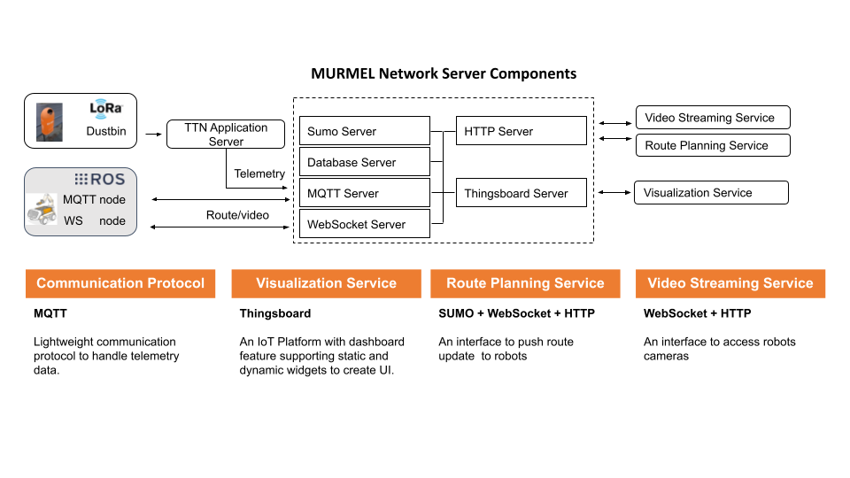

# Design and Implementation of a Communication Network for the project MURMEL
This archive contains the work done within the scope of the [thesis](/docs/master_thesis.pdf) submitted for the partial fulfillment of the requirement for a Master's Degree in Mechanical Engineering at Technische Universität Berlin.

The main purpose of the project is to establish a communication network for the project MURMEL based on the defined requirements. Via the developed communication
network, route information, sensor values, and actuator states will be instantly shared between services robots, smart dustbins, and the application control center.

## Table of contents
* [Introduction](#introduction)
* [Installation](#installation)
* [Simulation](#simulation)

## Introduction
The designed communication network for the project MURMEL consist of three components as below;

- Smart Dustbins
- Autonome Service Robots
- MURMEL Network Server 

### Smart Dustbin
The smart dustbin idea is based on robots’ route optimization to prevent unnecessary
driving schedules to empty non-full dustbins. The dustbins ’ state can be measured in
regular intervals by installing sensors in dustbins to measure the fullness levels. However,
for transmitting the sensor data to the central control center, dustbins must be equipped
with wireless communication modules.

### Autonome Service Robot
During the course of this undertaking the TU Berlin and its associated partner in this project the BSR will investigate how far a specially developed service robot can support and improve the existing process in the field of waste management in a city like Berlin. Autonome Service Robots will be the main focus in this context to automate the garbage collection procedures.

### MURMEL Network server
The developed MURMEL Network Server will be the central unit in the communication network between to link the communication between robots, dustbins, and the application control center.

## Installation

## Simulation
