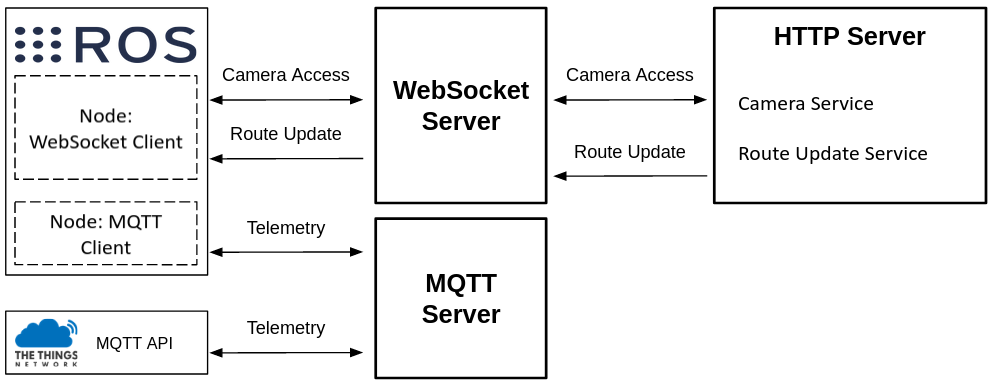

# MURMEL Network Server

## Overview
MURMEL Network Server consists of several servers and software programs used in the communication between the components.
The designed network server consists of the following servers
- WebSocket Server
- MQTT Server
- HTTP Server

In the figure below links between the servers can be seen.

 

## MQTT Server
MQTT Server is used to handle the telemetry data communication between robots and dustbins. Although robots can directly connect to MQTT Server via the 4G connection, telemetry data coming from dustbins are accessed via the MQTT API of the *[The Things Network](https://www.thethingsnetwork.org/docs/applications/mqtt/api/)*.

## WebSocket Server
WebSocket is used for handling transfer of the larger size of data such as multimedia streaming and updating route information. Although transferring route files an ben also established via FTP, webSocket is essentially used to stream camera frames from robots to MURMEL server to be later used in Camera Streamin Service.

## HTTP Server
The purpose of the HTTP Server is to establish a user interface for the communication between robot other browser based clients. As an output of the developed HTTP Server two different services are created as *Camera Service* and *Route Update Service*.

##### Camera Service
Camera Streaming Service enables users to access robots camera to control the video stream from robot to the murmel application server. Through the created HTML files users can easily start or stop the video stream from robot upon succesfully enabling Javascript to establish connections to WebSocket Server.

##### Route Update Service
Route Update Service enables users to send route/task files to the robot.

## Installation
For the installation of the Server application, following external libraries are needed to be installed.
- HTTP Server [more details about the library](https://pypi.org/project/Flask/)
  - pip install Flask

- WebSocket Server
  - pip install websockets

- MQTT Server
For demonstraton purposes a publich MQTT Server from [*Thingsboard*](https://thingsboard.io) is used. However any additonal MQTT Server can also be deployed.
  

